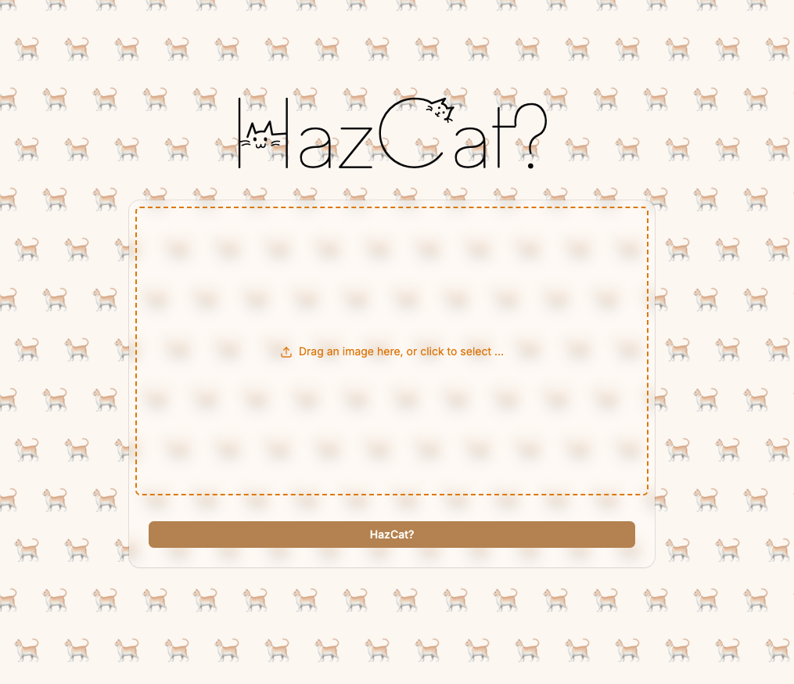

# HazCat?

 

This repository was created to support a training session / walkthrough on deploying packages to NPM. To make the session more engaging, I built a mock package and demo site, then walked through a satirical "business case" for protecting users from the emotional turmoil of viewing cat-free images.

## What's Inside

- **[lib/](lib/)** - The NPM package itself. Check out the [satirical README](lib/README.md) for the full "product pitch".
- **[site/](site/)** - A demo Astro site that consumes the package.

